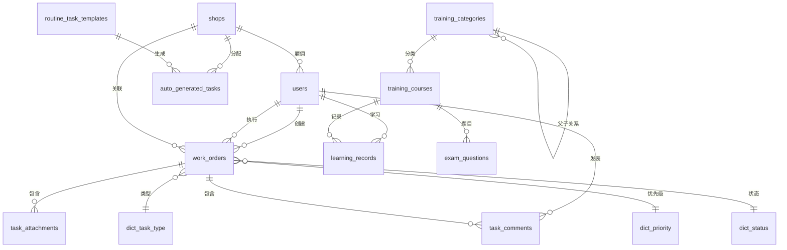

# 数据库设计文档

## 数据库信息

- **数据库名称**: `sunpizza_db`
- **字符集**: `utf8mb4`
- **排序规则**: `utf8mb4_unicode_ci`
- **数据库引擎**: InnoDB

---

## 表结构详细设计

### 1. 用户表 (users)

存储系统所有用户信息，包括管理员、区域经理和店长。

| 字段名 | 类型 | 长度 | 允许NULL | 默认值 | 说明 | 索引 |
|--------|------|------|----------|--------|------|------|
| id | INT | - | NO | - | 用户ID，主键 | PRIMARY KEY |
| username | VARCHAR | 50 | NO | - | 登录用户名 | UNIQUE |
| password_hash | VARCHAR | 255 | NO | - | 加密后的密码 | - |
| real_name | VARCHAR | 50 | NO | - | 真实姓名 | - |
| role | ENUM | - | NO | - | 角色：admin/regional_manager/shop_manager | INDEX |
| shop_id | INT | - | YES | NULL | 所属门店ID | FOREIGN KEY |
| created_at | TIMESTAMP | - | NO | CURRENT_TIMESTAMP | 创建时间 | - |

**外键约束**:
- `shop_id` REFERENCES `shops(id)` ON DELETE SET NULL

**索引**:
- PRIMARY KEY: `id`
- UNIQUE KEY: `username`
- KEY: `role`
- KEY: `shop_id`

---

### 2. 门店表 (shops)

存储所有门店信息。

| 字段名 | 类型 | 长度 | 允许NULL | 默认值 | 说明 | 索引 |
|--------|------|------|----------|--------|------|------|
| id | INT | - | NO | - | 门店ID，主键 | PRIMARY KEY |
| name | VARCHAR | 100 | NO | - | 门店名称 | UNIQUE |
| address | VARCHAR | 255 | YES | NULL | 门店地址 | - |
| regional_manager_id | INT | - | YES | NULL | 负责的区域经理ID | FOREIGN KEY |
| created_at | TIMESTAMP | - | NO | CURRENT_TIMESTAMP | 创建时间 | - |

**外键约束**:
- `regional_manager_id` REFERENCES `users(id)` ON DELETE SET NULL

**索引**:
- PRIMARY KEY: `id`
- UNIQUE KEY: `name`
- KEY: `regional_manager_id`

---

### 3. 任务类型字典表 (dict_task_type)

任务类型标准字典，**仅可由总部管理员维护**。

| 字段名 | 类型 | 长度 | 允许NULL | 默认值 | 说明 | 索引 |
|--------|------|------|----------|--------|------|------|
| id | INT | - | NO | - | 类型ID，主键 | PRIMARY KEY |
| type_name | VARCHAR | 50 | NO | - | 类型名称 | UNIQUE |
| color | VARCHAR | 7 | YES | NULL | 显示颜色（如 #FF0000） | - |

**初始数据**:
```sql
INSERT INTO `dict_task_type` (`id`, `type_name`, `color`) VALUES
(1, '稽查整改', '#FF6B6B'),
(2, '营销活动', '#4ECDC4'),
(3, '设备报修', '#45B7D1'),
(4, '物料申请', '#96CEB4'),
(5, '人员调度', '#F7C46C'),
(6, '其他', '#9E9E9E');
```

---

### 4. 优先级字典表 (dict_priority)

工单优先级字典。

| 字段名 | 类型 | 长度 | 允许NULL | 默认值 | 说明 | 索引 |
|--------|------|------|----------|--------|------|------|
| id | INT | - | NO | - | 优先级ID，主键 | PRIMARY KEY |
| priority_name | VARCHAR | 20 | NO | - | 优先级名称 | UNIQUE |
| color | VARCHAR | 7 | YES | NULL | 显示颜色 | - |
| sort_order | INT | - | NO | 0 | 排序顺序（数字越大优先级越高） | - |

**初始数据**:
```sql
INSERT INTO `dict_priority` (`id`, `priority_name`, `color`, `sort_order`) VALUES
(1, '低', '#5DADE2', 1),
(2, '中', '#F4D03F', 2),
(3, '高', '#EC7063', 3);
```

---

### 5. 状态字典表 (dict_status)

工单状态字典。

| 字段名 | 类型 | 长度 | 允许NULL | 默认值 | 说明 | 索引 |
|--------|------|------|----------|--------|------|------|
| id | INT | - | NO | - | 状态ID，主键 | PRIMARY KEY |
| status_name | VARCHAR | 20 | NO | - | 状态名称 | UNIQUE |
| color | VARCHAR | 7 | YES | NULL | 显示颜色 | - |

**初始数据**:
```sql
INSERT INTO `dict_status` (`id`, `status_name`, `color`) VALUES
(1, '待受理', '#95A5A6'),
(2, '进行中', '#3498DB'),
(3, '已完成', '#2ECC71'),
(4, '已关闭', '#7F8C8D');
```

---

### 6. 工单任务主表 (work_orders)

存储所有工单任务信息，支持双向的需求提报与任务分配。

| 字段名 | 类型 | 长度 | 允许NULL | 默认值 | 说明 | 索引 |
|--------|------|------|----------|--------|------|------|
| id | INT | - | NO | - | 工单ID，主键 | PRIMARY KEY |
| title | VARCHAR | 255 | NO | - | 任务标题 | - |
| description | TEXT | - | YES | NULL | 任务详细描述 | - |
| type_id | INT | - | NO | - | 任务类型ID | FOREIGN KEY |
| priority_id | INT | - | NO | - | 优先级ID | FOREIGN KEY |
| status_id | INT | - | NO | - | 状态ID | FOREIGN KEY |
| creator_id | INT | - | NO | - | 创建人ID | FOREIGN KEY |
| assignee_id | INT | - | NO | - | 执行人ID | FOREIGN KEY |
| shop_id | INT | - | NO | - | 关联门店ID | FOREIGN KEY |
| due_date | DATETIME | - | NO | - | 截止时间 | INDEX |
| completion_notes | TEXT | - | YES | NULL | 完成备注 | - |
| completion_progress | TINYINT | - | NO | 0 | 完成进度（0-100） | - |
| created_at | TIMESTAMP | - | NO | CURRENT_TIMESTAMP | 创建时间 | INDEX |
| updated_at | TIMESTAMP | - | NO | CURRENT_TIMESTAMP | 最后更新时间 | - |

**外键约束**:
- `type_id` REFERENCES `dict_task_type(id)`
- `priority_id` REFERENCES `dict_priority(id)`
- `status_id` REFERENCES `dict_status(id)`
- `creator_id` REFERENCES `users(id)`
- `assignee_id` REFERENCES `users(id)`
- `shop_id` REFERENCES `shops(id)`

**索引**:
- PRIMARY KEY: `id`
- KEY: `type_id`, `priority_id`, `status_id`, `creator_id`, `assignee_id`, `shop_id`
- KEY: `due_date`
- KEY: `created_at`

---

### 7. 任务评论/沟通表 (task_comments)

存储工单的评论和沟通记录。

| 字段名 | 类型 | 长度 | 允许NULL | 默认值 | 说明 | 索引 |
|--------|------|------|----------|--------|------|------|
| id | INT | - | NO | - | 评论ID，主键 | PRIMARY KEY |
| work_order_id | INT | - | NO | - | 所属工单ID | FOREIGN KEY |
| author_id | INT | - | NO | - | 评论人ID | FOREIGN KEY |
| content | TEXT | - | NO | - | 评论内容 | - |
| attachment_url | VARCHAR | 500 | YES | NULL | 附件链接 | - |
| created_at | TIMESTAMP | - | NO | CURRENT_TIMESTAMP | 评论时间 | - |

**外键约束**:
- `work_order_id` REFERENCES `work_orders(id)` ON DELETE CASCADE
- `author_id` REFERENCES `users(id)`

**索引**:
- PRIMARY KEY: `id`
- KEY: `work_order_id`
- KEY: `author_id`

---

### 8. 任务附件表 (task_attachments)

存储工单的附件文件。

| 字段名 | 类型 | 长度 | 允许NULL | 默认值 | 说明 | 索引 |
|--------|------|------|----------|--------|------|------|
| id | INT | - | NO | - | 附件ID，主键 | PRIMARY KEY |
| work_order_id | INT | - | NO | - | 所属工单ID | FOREIGN KEY |
| file_name | VARCHAR | 255 | NO | - | 文件名 | - |
| file_url | VARCHAR | 500 | NO | - | 文件URL | - |
| file_type | VARCHAR | 50 | YES | NULL | 文件类型 | - |
| uploaded_by | INT | - | YES | NULL | 上传人ID | FOREIGN KEY |
| uploaded_at | TIMESTAMP | - | NO | CURRENT_TIMESTAMP | 上传时间 | - |

**外键约束**:
- `work_order_id` REFERENCES `work_orders(id)` ON DELETE CASCADE
- `uploaded_by` REFERENCES `users(id)`

---

### 9. 标准清洁任务模板表 (routine_task_templates)

存储日清/周清/月清的任务模板，**仅可由总部管理员维护**。

| 字段名 | 类型 | 长度 | 允许NULL | 默认值 | 说明 | 索引 |
|--------|------|------|----------|--------|------|------|
| id | INT | - | NO | - | 模板ID，主键 | PRIMARY KEY |
| task_name | VARCHAR | 255 | NO | - | 任务名称 | - |
| description | TEXT | - | YES | NULL | 任务描述 | - |
| frequency | ENUM | - | NO | - | 频率：daily/weekly/monthly | INDEX |
| checklist_json | JSON | - | YES | NULL | 检查清单（JSON数组） | - |
| is_active | BOOLEAN | - | NO | TRUE | 是否启用 | - |
| created_at | TIMESTAMP | - | NO | CURRENT_TIMESTAMP | 创建时间 | - |

**JSON格式示例**:
```json
[
  {
    "item": "地面清洁",
    "required_photo": true
  },
  {
    "item": "桌面擦拭",
    "required_photo": false
  }
]
```

---

### 10. 自动生成任务表 (auto_generated_tasks)

系统自动生成的日清/周清/月清任务实例。

| 字段名 | 类型 | 长度 | 允许NULL | 默认值 | 说明 | 索引 |
|--------|------|------|----------|--------|------|------|
| id | INT | - | NO | - | 任务ID，主键 | PRIMARY KEY |
| template_id | INT | - | NO | - | 模板ID | FOREIGN KEY |
| shop_id | INT | - | NO | - | 门店ID | FOREIGN KEY |
| due_date | DATE | - | NO | - | 任务对应日期 | INDEX |
| is_completed | BOOLEAN | - | NO | FALSE | 是否完成 | - |
| completed_at | TIMESTAMP | - | YES | NULL | 完成时间 | - |
| completed_by | INT | - | YES | NULL | 完成人ID | FOREIGN KEY |
| checklist_status | JSON | - | YES | NULL | 检查清单完成状态 | - |

**外键约束**:
- `template_id` REFERENCES `routine_task_templates(id)`
- `shop_id` REFERENCES `shops(id)`
- `completed_by` REFERENCES `users(id)`

**索引**:
- PRIMARY KEY: `id`
- KEY: `template_id`, `shop_id`, `due_date`
- UNIQUE KEY: `(shop_id, template_id, due_date)` - 防止重复生成

---

### 11. 培训分类表 (training_categories)

培训内容的分类树结构。

| 字段名 | 类型 | 长度 | 允许NULL | 默认值 | 说明 | 索引 |
|--------|------|------|----------|--------|------|------|
| id | INT | - | NO | - | 分类ID，主键 | PRIMARY KEY |
| name | VARCHAR | 100 | NO | - | 分类名称 | - |
| parent_id | INT | - | YES | NULL | 父分类ID（NULL表示顶级分类） | FOREIGN KEY |
| type | ENUM | - | NO | - | 类型：product/service/operation | INDEX |
| sort_order | INT | - | NO | 0 | 排序顺序 | - |

**外键约束**:
- `parent_id` REFERENCES `training_categories(id)` ON DELETE CASCADE

---

### 12. 培训课程表 (training_courses)

存储所有培训课程内容。

| 字段名 | 类型 | 长度 | 允许NULL | 默认值 | 说明 | 索引 |
|--------|------|------|----------|--------|------|------|
| id | INT | - | NO | - | 课程ID，主键 | PRIMARY KEY |
| title | VARCHAR | 255 | NO | - | 课程标题 | - |
| description | TEXT | - | YES | NULL | 课程描述 | - |
| category_id | INT | - | NO | - | 分类ID | FOREIGN KEY |
| content_type | ENUM | - | NO | - | 内容类型：text/pdf/video | - |
| content_url | VARCHAR | 500 | YES | NULL | 内容URL（视频、PDF链接） | - |
| content_text | TEXT | - | YES | NULL | 文本内容 | - |
| has_exam | BOOLEAN | - | NO | FALSE | 是否有考试 | - |
| is_published | BOOLEAN | - | NO | TRUE | 是否发布 | - |
| created_at | TIMESTAMP | - | NO | CURRENT_TIMESTAMP | 创建时间 | - |

**外键约束**:
- `category_id` REFERENCES `training_categories(id)`

---

### 13. 考试题库表 (exam_questions)

存储培训课程的考试题目。

| 字段名 | 类型 | 长度 | 允许NULL | 默认值 | 说明 | 索引 |
|--------|------|------|----------|--------|------|------|
| id | INT | - | NO | - | 题目ID，主键 | PRIMARY KEY |
| course_id | INT | - | NO | - | 课程ID | FOREIGN KEY |
| question_text | TEXT | - | NO | - | 题目内容 | - |
| question_type | ENUM | - | NO | - | 题型：single_choice/multiple_choice/true_false | - |
| options | JSON | - | YES | NULL | 选项数组 | - |
| correct_answer | VARCHAR | 255 | NO | - | 正确答案 | - |

**外键约束**:
- `course_id` REFERENCES `training_courses(id)` ON DELETE CASCADE

**JSON格式示例**:
```json
["A. 选项1", "B. 选项2", "C. 选项3", "D. 选项4"]
```

---

### 14. 学习记录表 (learning_records)

记录用户的学习进度和考试成绩。

| 字段名 | 类型 | 长度 | 允许NULL | 默认值 | 说明 | 索引 |
|--------|------|------|----------|--------|------|------|
| id | INT | - | NO | - | 记录ID，主键 | PRIMARY KEY |
| user_id | INT | - | NO | - | 用户ID | FOREIGN KEY |
| course_id | INT | - | NO | - | 课程ID | FOREIGN KEY |
| completed | BOOLEAN | - | NO | FALSE | 是否完成 | - |
| exam_score | INT | - | YES | NULL | 考试分数（0-100） | - |
| exam_passed | BOOLEAN | - | NO | FALSE | 考试是否通过（80分以上） | - |
| started_at | TIMESTAMP | - | NO | CURRENT_TIMESTAMP | 开始学习时间 | - |
| completed_at | TIMESTAMP | - | YES | NULL | 完成时间 | - |

**外键约束**:
- `user_id` REFERENCES `users(id)` ON DELETE CASCADE
- `course_id` REFERENCES `training_courses(id)` ON DELETE CASCADE

**索引**:
- PRIMARY KEY: `id`
- UNIQUE KEY: `(user_id, course_id)` - 每个用户每门课程只有一条记录
- KEY: `user_id`, `course_id`

---

## 数据库关系图



---

## 索引策略

### 高频查询优化

1. **工单查询优化**
   - 按门店+状态查询：`INDEX(shop_id, status_id)`
   - 按执行人+状态查询：`INDEX(assignee_id, status_id)`
   - 按截止日期范围查询：`INDEX(due_date)`

2. **自动任务查询优化**
   - 按门店+日期查询：`INDEX(shop_id, due_date)`
   - 防止重复生成：`UNIQUE(shop_id, template_id, due_date)`

3. **培训记录查询优化**
   - 按用户查询学习记录：`INDEX(user_id)`
   - 防止重复学习记录：`UNIQUE(user_id, course_id)`

---

## 数据完整性约束

### 级联操作

1. **CASCADE（级联删除）**
   - 删除工单时，级联删除其评论和附件
   - 删除培训课程时，级联删除其题目和学习记录
   - 删除分类时，级联删除其子分类

2. **SET NULL（设置为NULL）**
   - 删除门店时，员工的shop_id设置为NULL
   - 删除区域经理时，门店的regional_manager_id设置为NULL

### 业务约束

1. **店长必须关联门店**
   - 应用层验证：创建/更新店长用户时，必须提供shop_id

2. **工单状态流转规则**
   - 待受理 → 进行中 → 已完成/已关闭
   - 应用层实现状态机

3. **考试通过标准**
   - 分数 ≥ 80 时，exam_passed = TRUE

---

## 性能优化建议

1. **分区策略**
   - `work_orders` 表按创建时间分区（按月）
   - `task_comments` 表按创建时间分区（按季度）

2. **归档策略**
   - 已关闭超过1年的工单，移至历史表
   - 保留主表索引性能

3. **缓存策略**
   - 字典表数据（任务类型、优先级、状态）使用Redis缓存
   - 培训分类树使用应用层缓存

---

## 备份与恢复

### 备份策略

1. **全量备份**：每日凌晨3点
2. **增量备份**：每4小时一次
3. **binlog备份**：实时保留7天

### 恢复演练

- 每月进行一次恢复演练
- 验证数据完整性和一致性

